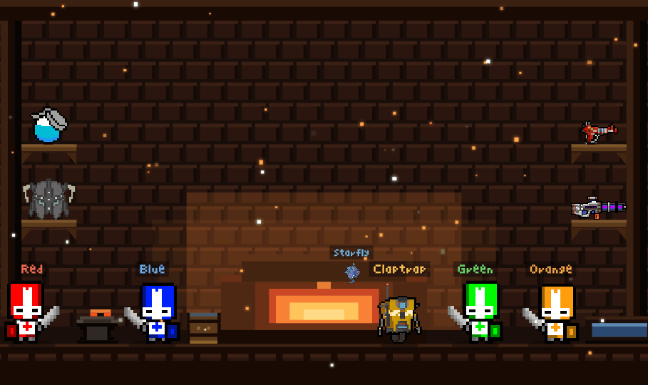

# ⚔️  NICKY (ZIYANG) TIAN



```
┌─────────────────────────────────────────────────────────────┐
│  CLASS: Software Engineer   ·   LVL: Final-Year   ·   UoA     │
│  LOC: Auckland, NZ          ·   FOCUS: Full-Stack / Systems   │
└─────────────────────────────────────────────────────────────┘
```

> Final-year Software Engineering student — full-stack, systems, and a soft spot for game dev.
> I build things that look like games and run like infrastructure.

🎮 **Playable portfolio:** [nickytian.vercel.app](https://nickytian.vercel.app/) — every section is a hand-drawn pixel world.

---

## 🗺️  ACTIVE QUESTS

- 🔆 **[Solar-Powered Micro Data Centre](https://github.com/Ajith05105/K3S-cluster-bootstrap)** — air-gapped K3s GitOps cluster on Raspberry Pi 5 (Gitea · ArgoCD · Ansible). Researching post-quantum crypto & data sovereignty for sovereign edge infra.
- 🛡️ **[APParel — Web CTF Lab](https://github.com/UOA-CS732-S1-2026/group-project-access-denied)** — deliberately vulnerable MERN e-commerce platform with 12 embedded CTF challenges, a paid-hint system & 333 automated tests. Deployed on Vercel.
- 🧟 **[Project Zombie](https://github.com/Nicky8566/Project_Roguelite)** — a roguelite built for the love of game dev.

---

## 🧰  INVENTORY


---

## 📊  STATS

<p>
  
  
</p>

---

## 📫  FIND ME

📍 Auckland, New Zealand  ·  🎓 University of Auckland

<!--
  Banner: experience-banner.png (exported from the site's forge scene).
  Upload it into the Nicky8566 repo alongside this README so the ![banner] link resolves.
-->
