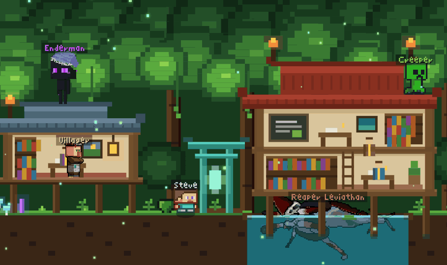

# Nicky (Ziyang) Tian

Final-year Software Engineering student at the University of Auckland — full-stack, systems, and a soft spot for game dev. I build things that look like games and run like infrastructure.

🎮 **Playable portfolio:** [nickytian.vercel.app](https://nickytian.vercel.app/) — every section is a hand-drawn pixel world.

---

## Projects

- **[Solar-Powered Micro Data Centre](https://github.com/Ajith05105/K3S-cluster-bootstrap)** — air-gapped K3s GitOps cluster on Raspberry Pi 5 (Gitea · ArgoCD · Ansible). Researching post-quantum crypto & data sovereignty for sovereign edge infrastructure.
- **[APParel — Web CTF Lab](https://github.com/UOA-CS732-S1-2026/group-project-access-denied)** — deliberately vulnerable MERN e-commerce platform with 12 embedded CTF challenges, a paid-hint system & 333 automated tests. Deployed on Vercel.
- **[Project Zombie](https://github.com/Nicky8566/Project_Roguelite)** — a roguelite built for the love of game dev.

---

## Tech Stack

**Languages:** TypeScript · JavaScript · Python
**Frontend:** React
**Backend:** Node.js · Express · MongoDB
**Infra / DevOps:** K3s · Docker · Ansible · ArgoCD · GitHub Actions

---

## Find Me

📍 Auckland, New Zealand &nbsp;·&nbsp; 🎓 University of Auckland

<!--
  Banner: education-banner.png (exported from the site's Minecraft-village scene).
  Upload it into the Nicky8566 repo alongside this README so the ![banner] link resolves.
-->
